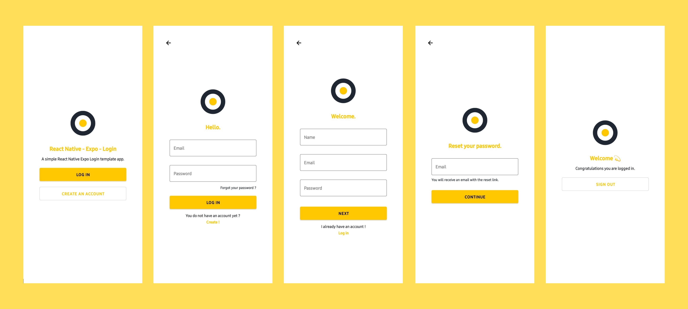

# React Native Expo Login 🚀

A simple React Native Expo Login template starter app.  



## About ✔️

What can you do with this template 🤔

- Log in with an email address and password.
- Create an account with a name, email address and password.
- Sign out.

This template is a good way to start an application with a system of connection, disconnection, and creation of an account.  
You will just need to adapt it according to your needs.

[](https://github.com/GalsenDev221/made.in.senegal)

## Usage ℹ️

Click on the **[Use this template](https://github.com/daoodaba975/exlogrn/generate)** button on this page to clone this respository to your GitHub account or you can clone this respository.

- **Install dependencies**

```js
npm install // using Npm
// or
yarn install // using Yarn
```

- **Run project**

```js
expo start
// or
make r // if you have MAKE installed
```

### Licence 🚨

This template is released under the **[MIT License](LICENSE.md)**.

Enjoy ✌🏽

<a href="https://www.buymeacoffee.com/daoodaba975" target="_blank"></a>
